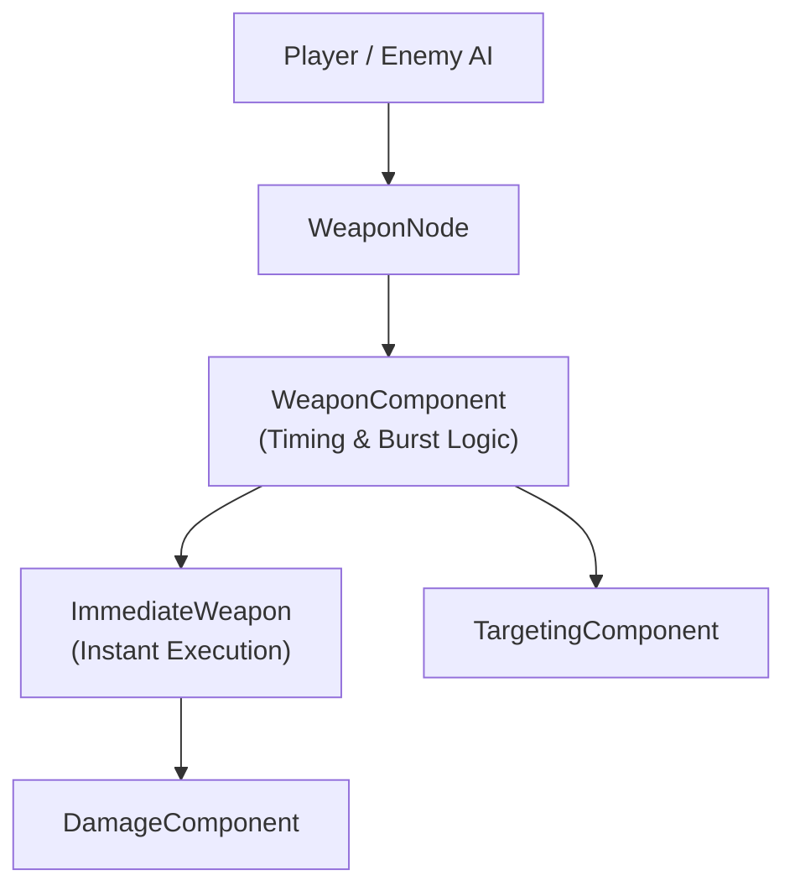
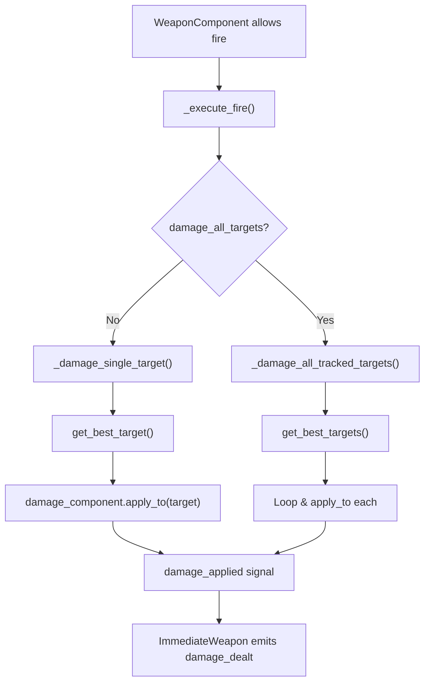

# ✅ ImmediateWeapon – Instant Damage Execution System

## Purpose

**ImmediateWeapon** is the **instant / hitscan execution layer** that applies damage **directly to targets with no physical projectiles**.

It is used for:

- Laser beams
    
- Melee attacks
    
- Shockwaves
    
- Auras
    
- Pulses
    
- Chain-lightning style logic (via Targeting)
    
- Damage-over-time triggers when driven by continuous fire
    

Like all your systems, it is:

✅ Logic-only  
✅ RefCounted  
✅ Scene-independent  
✅ Fully driven by **WeaponComponent timing**  
✅ Fully driven by **TargetingComponent selection**  
✅ Fully driven by **DamageComponent resolution**

---

## What It Does

✅ Applies damage instantly  
✅ Supports single-target and multi-target damage  
✅ Delegates all damage math to DamageComponent  
✅ Uses TargetingComponent for target resolution  
✅ Emits success & failure signals  
✅ Can be driven by burst, continuous, or auto fire  
✅ Works with player, enemies, turrets, traps, and abilities

---

## What It Does NOT Do

❌ Spawn projectiles  
❌ Perform raycasts  
❌ Detect targets  
❌ Control fire timing  
❌ Handle input  
❌ Choose which target is best  
❌ Apply damage math directly

Those responsibilities belong to:

- **WeaponComponent** → timing & fire control
    
- **TargetingComponent** → target selection
    
- **DamageComponent** → damage calculation & resolution
    
- **WeaponNode / ImmediateWeaponNode** → authoring + inspector
    

---

## Position in the Combat Stack



---

# Fire Execution Lifecycle



---

# Core Execution Concepts

---

## 1. DamageComponent Injection

```gdscript
var damage_component: DamageComponent
```

All damage is delegated to:

```gdscript
damage_component.apply_to(target)
```

ImmediateWeapon:  
✅ Never calculates damage  
✅ Never applies health changes directly  
✅ Only requests damage execution

This ensures:  
✅ Full separation of combat math  
✅ Full compatibility with buffs, crits, status effects  
✅ Global control over damage behavior

---

## 2. TargetingComponent Injection

```gdscript
var targeting_component: TargetingComponent
```

All targets are queried via:

```gdscript
get_best_target()
get_best_targets()
```

ImmediateWeapon:  
✅ Never queries Area2D  
✅ Never checks distances  
✅ Never sorts targets  
✅ Never validates health

That is all handled by **TargetingComponent**.

---

## 3. Fire Eligibility Rules (can_fire)

```gdscript
func can_fire() -> bool:
	if not super.can_fire():
		return false
	if not damage_component or not targeting_component:
		return false
	return targeting_component.get_best_target() != null
```

This means ImmediateWeapon **refuses to fire** if:

❌ Cooldown not ready  
❌ Burst not allowed  
❌ No DamageComponent  
❌ No TargetingComponent  
❌ No valid target

This is **correct behavior for hitscan weapons**.

---

## 4. Single Target Damage Mode

Default behavior:

```gdscript
damage_all_targets = false
```

Execution:

```gdscript
var target = targeting_component.get_best_target()
damage_component.apply_to(target)
```

Used for:

✅ Lasers  
✅ Snipers  
✅ Punches  
✅ Single-hit abilities

---

## 5. Multi-Target Damage Mode

```gdscript
damage_all_targets = true
```

Execution:

```gdscript
for target in targeting_component.get_best_targets():
	damage_component.apply_to(target)
```

Used for:

✅ Shockwaves  
✅ Pulses  
✅ Auras  
✅ Chain lightning bases  
✅ Room-wide abilities

⚠ This is **logically equivalent to AoE**, but still target-driven and filtered.

---

# Signals

|Signal|Description|
|---|---|
|`damage_dealt(target, result)`|Emitted when damage succeeds|
|`damage_failed(target)`|Emitted when damage fails|

These are forwarded directly from DamageComponent.

---

# Example Weapon Presets (Immediate)

---

## 1. Laser Beam

```
fire_mode = CONTINUOUS
stop_condition = MANUAL
auto_fire = false
damage_all_targets = false
fire_interval = 0.05
```

✅ Constant damage stream while button held

---

## 2. Shockwave Pulse

```
fire_mode = SINGLE
auto_fire = false
damage_all_targets = true
fire_rate = 0.6
```

✅ Room-wide pulse every 0.6s

---

## 3. Chain-Lightning Base

```
fire_mode = SINGLE
auto_fire = true
damage_all_targets = true
fire_rate = 4.0
```

✅ Rapid multi-target strikes (actual chaining can be layered later)

---

## 4. Melee Combo Hitbox

```
fire_mode = CONTINUOUS
stop_condition = SHOT_COUNT
max_shots = 3
fire_interval = 0.12
damage_all_targets = false
```

✅ 3-hit combo burst

---

# Common Pitfalls

- Forgetting to assign `damage_component`
    
- Forgetting to assign `targeting_component`
    
- Expecting free-fire behavior (ImmediateWeapon always requires targets)
    
- Using `damage_all_targets = true` with very large targeting sets
    
- Driving heavy AoE damage at extremely low fire intervals
    

---

# Design Summary

> **ImmediateWeapon is a pure instant-damage execution system driven entirely by WeaponComponent timing and TargetingComponent selection.**

It answers only one question:

> **"Which targets should receive damage right now?"**

Everything else — input, timing, target detection, damage math, buffs, and AI — is handled by separate systems.

---