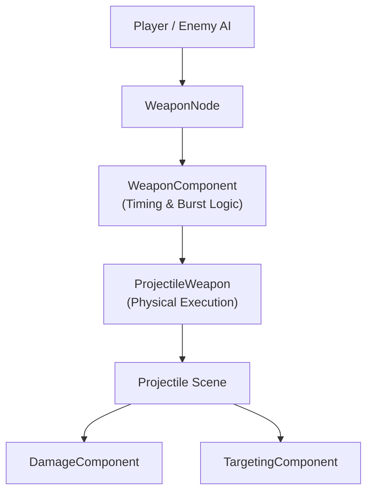
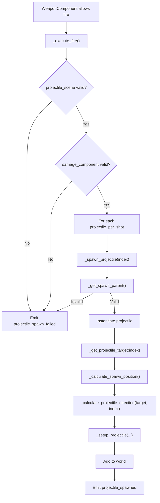
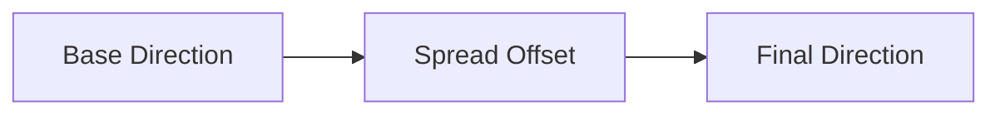

# ProjectileWeapon – Physical Projectile Execution System

## Purpose

**ProjectileWeapon** is the **physical projectile execution layer** that sits directly under **WeaponComponent**.

It is responsible for:

- Instantiating projectile scenes
    
- Resolving fire direction
    
- Applying spread
    
- Assigning velocity & speed
    
- Assigning targets
    
- Injecting damage requests
    
- Handling fire-point offsets
    
- Applying runtime projectile properties
    
- Emitting spawn success / failure signals
    

It is a **logic-driven execution system**, not an authoring tool.

---

## What It Does

✅ Spawns physical projectiles  
✅ Resolves projectile direction from multiple modes  
✅ Supports multi-projectile shots  
✅ Handles even & random spread  
✅ Supports free-fire and targeted fire  
✅ Injects DamageComponent requests into projectiles  
✅ Injects runtime projectile properties dynamically  
✅ Handles owner velocity inheritance  
✅ Emits reliable spawn signals

---

## What It Does NOT Do

❌ Control cooldowns or burst timing  
❌ Decide _when_ firing is allowed  
❌ Handle player or AI input  
❌ Perform target detection  
❌ Apply damage directly  
❌ Own collision filtering logic  
❌ Exist as a scene-authoring weapon

All firing eligibility is handled by **WeaponComponent**.

---

## System Position in Combat Stack



---

## Fire Execution Lifecycle



---

# Core Execution Concepts

---

## 1. Projectile Scene

```gdscript
var projectile_scene: PackedScene
```

This is the **physical bullet prefab**. It is required.

If unset:

- Firing fails
    
- `projectile_spawn_failed` is emitted
    

---

## 2. Damage Injection

```gdscript
var damage_component: DamageComponent
```

If the projectile exposes:

```gdscript
damage_request
```

Then:

```gdscript
projectile.damage_request = damage_component.create_request()
```

This ensures:  
✅ No damage logic inside ProjectileWeapon  
✅ Projectiles are damage-agnostic  
✅ Buff systems can mutate damage externally

---

## 3. Target Injection

If the projectile exposes:

```gdscript
target
```

Then:

```gdscript
projectile.target = target
```

This enables:  
✅ Homing bullets  
✅ Tracking missiles  
✅ Smart projectiles

---

## 4. Velocity & Speed Injection

If the projectile exposes:

```gdscript
velocity
```

Then:

```gdscript
velocity = direction * projectile_speed
```

If enabled:

```gdscript
inherit_owner_velocity = true
```

Owner velocity is added:

```gdscript
velocity += owner.velocity
```

---

## 5. Multi-Projectile Shots

```gdscript
projectiles_per_shot: int = 1
```

Each fire execution spawns:

```
1 → single bullet  
N → shotgun / fan / cone / wall
```

Each projectile calls:

```gdscript
_spawn_projectile(index)
```

---

## 6. Spread System

```gdscript
spread_angle: float
spread_mode: EVEN | RANDOM
```

### EVEN

Projectiles are evenly spaced across the spread cone.

### RANDOM

Each projectile gets a random angle within the cone.



---

## 7. Direction Resolution Modes

```gdscript
enum DirectionMode {
	TO_TARGET,
	OWNER_FORWARD,
	OWNER_ROTATION,
	MOUSE_POSITION,
	CUSTOM
}
```

|Mode|Behavior|
|---|---|
|TO_TARGET|Aims at best target|
|OWNER_FORWARD|Fires along owner's facing|
|OWNER_ROTATION|Uses exact Node2D rotation|
|MOUSE_POSITION|Aims at cursor|
|CUSTOM|Uses manually supplied vector|

---

## 8. No Target Behavior

```gdscript
enum NoTargetBehavior {
	DONT_FIRE,
	RANDOM_DIRECTION,
	OWNER_FORWARD
}
```

|Mode|Result|
|---|---|
|DONT_FIRE|Weapon refuses to fire|
|RANDOM_DIRECTION|Fires in random direction|
|OWNER_FORWARD|Fires forward anyway|

This is enforced in:

```gdscript
func can_fire() -> bool
```

---

## 9. Spawn Offset System

```gdscript
spawn_offset: Vector2
```

Applied as:

```gdscript
owner.global_position
+ rotated spawn_offset
```

This enables:  
✅ Dual barrels  
✅ Wing cannons  
✅ Muzzle positioning  
✅ Rotating emitters

---

## 10. Spawn Parent Resolution

```gdscript
spawn_parent → override  
owner.get_parent() → fallback
```

If invalid:  
✅ Firing fails  
✅ Failure signal emitted

---

## 11. Cycling Multi-Target Behavior

```gdscript
cycle_targets: bool
target_cycle_index: int
```

Target selection modes:

|Mode|Behavior|
|---|---|
|cycle_targets = true|Rotates through tracked targets per shot|
|cycle_targets = false|Uses index-based allocation|

---

## 12. Projectile Runtime Property Injection

Dynamic property assignment using dot-paths:

```gdscript
projectile_properties["sprite.modulate"] = Color.RED
projectile_properties["trail.enabled"] = true
```

Resolved via:

```gdscript
_set_nested_property()
```

This enables:  
✅ Per-weapon visuals  
✅ Homing strength tuning  
✅ Elemental overrides  
✅ Trail color swaps  
✅ Behavior mutations without subclassing

---

# Signals

|Signal|Description|
|---|---|
|projectile_spawned(projectile, target)|Emitted for each successful spawn|
|projectile_spawn_failed()|Emitted on any hard failure|

---

# Fire Eligibility Rules

ProjectileWeapon **does not override WeaponComponent timing**, but **can block fire** at execution time:

```gdscript
if no_target_behavior == DONT_FIRE and no target:
	return false
```

Meaning:

✅ WeaponComponent may allow fire  
✅ ProjectileWeapon may still deny it due to missing target

This is **intentional and correct**.

---

# Example Weapon Presets

---

## 1. Basic Bullet Pistol

```
projectiles_per_shot = 1
spread_angle = 0
direction_mode = OWNER_FORWARD
projectile_speed = 450
no_target_behavior = OWNER_FORWARD
```

---

## 2. Shotgun

```
projectiles_per_shot = 8
spread_angle = 55
spread_mode = EVEN
direction_mode = OWNER_FORWARD
projectile_speed = 380
```

---

## 3. Sniper Rifle

```
projectiles_per_shot = 1
spread_angle = 0
direction_mode = TO_TARGET
projectile_speed = 1200
no_target_behavior = DONT_FIRE
```

---

## 4. Missile Launcher

```
projectiles_per_shot = 1
direction_mode = TO_TARGET
inherit_owner_velocity = true
projectile_speed = 260
```

---

## 5. Reverse Bullet-Hell Wall Emitter

```
projectiles_per_shot = 30
spread_angle = 120
spread_mode = EVEN
direction_mode = OWNER_FORWARD
projectile_speed = 220
auto_fire = true
fire_interval = 0.05
```

---

# Common Pitfalls

- Forgetting to assign `projectile_scene`
    
- Leaving `damage_component` null
    
- Setting `DONT_FIRE` with no active targeting
    
- Using excessive `projectiles_per_shot` + small `fire_interval`
    
- Forgetting to rotate `spawn_offset`
    
- Overusing dynamic property injection per frame
    

---

# Design Summary

> **ProjectileWeapon is a deterministic, data-driven projectile execution system that converts WeaponComponent timing signals into real-world physical bullets.**

It answers only one question:

> **"What exactly should be spawned when the weapon is allowed to fire?"**

Everything else — timing, targeting, damage logic, buffs, AI, and player input — is handled by other systems.

---