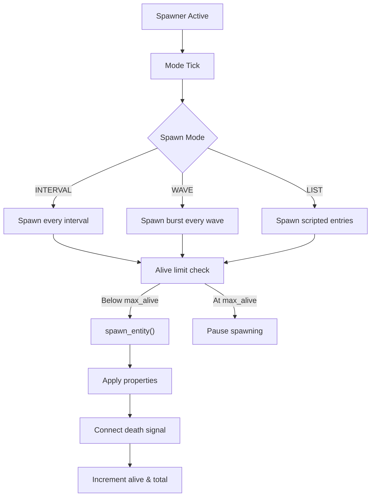

# SpawnerComponent – Flexible Runtime Entity Spawning System

**Engine:** Godot 4  
**Type:** Scene-based spawner (Node2D)  
**Role:** Enemy / entity creation, wave control, and population management

---

## Purpose

**SpawnerComponent** is a **highly flexible runtime spawning controller** responsible for:

- Creating entities from one or multiple scenes
    
- Controlling _where_ entities spawn (area shapes & edges)
    
- Controlling _when_ entities spawn (intervals, waves, scripted lists)
    
- Enforcing:
    
    - **Concurrent population limits (`max_alive`)**
        
    - **Lifetime hard caps (`max_spawns`)**
        
- Applying **dynamic per-entity properties**
    
- Tracking entity lifecycle via death signals
    
- Providing **debug visualization in-editor**
    

It is designed to support:

✅ Roguelike waves  
✅ Bullet-hell enemy floods  
✅ Boss phase summoning  
✅ Elite injections  
✅ Endless survival modes  
✅ Scripted encounter timelines

---

## What It Does

✅ Spawns entities from one or multiple scenes  
✅ Supports **interval**, **wave**, and **scripted list** modes  
✅ Enforces **soft alive limits** (`max_alive`)  
✅ Enforces **hard lifetime limits** (`max_spawns`)  
✅ Tracks alive population reliably  
✅ Applies **nested properties via dot paths**  
✅ Applies **context-scaled advanced properties**  
✅ Supports **editor-only spawn visualization**  
✅ Emits high-level gameplay signals

---

## What It Does NOT Do

❌ Control enemy AI  
❌ Control enemy weapons  
❌ Apply damage  
❌ Handle combat logic  
❌ Handle difficulty scaling (Director system will drive it)

SpawnerComponent is a **pure population controller**, not a behavior system.

---

# High-Level Runtime Flow



---

# Spawn Modes

```gdscript
enum SpawnMode {
	INTERVAL,
	WAVE,
	LIST
}
```

---

## 1️⃣ INTERVAL Mode

Spawns entities at a fixed time step.

```gdscript
spawn_interval: float
entities_per_spawn: int
```

**Behavior:**

- Every `spawn_interval` seconds:
    
    - Spawn up to `entities_per_spawn`
        
    - Stops early if `max_alive` is reached
        

✅ Best for:

- Endless enemies
    
- Ambient population
    
- Survival modes
    

---

## 2️⃣ WAVE Mode

Spawns bursts of enemies in fixed packs.

```gdscript
wave_interval: float
wave_size: int
```

**Behavior:**

- Every `wave_interval` seconds:
    
    - Spawn up to `wave_size`
        
    - Emits `wave_completed(wave_number)`
        

✅ Best for:

- Horde combat
    
- Timed attack waves
    
- Arena escalation
    

---

## 3️⃣ LIST Mode (Scripted Timeline)

```gdscript
spawn_list: Dictionary[float, Array]
```

**Format:**

```gdscript
{
	0.0: [0],
	2.5: [1, 1],
	5.0: [0, 1, 2]
}
```

**Behavior:**

- Spawns exact scene indices at exact delays
    
- Fully deterministic
    
- Emits `list_completed()` when finished
    

✅ Best for:

- Boss intros
    
- Cutscene battles
    
- Hand-authored encounters
    

---

# Spawn Limits

```gdscript
max_alive: int   # Soft concurrent cap
max_spawns: int  # Hard lifetime cap
```

---

## ✅ `max_alive` (Soft Cap – Concurrent Population)

- Limits how many enemies can exist **at the same time**
    
- When reached:  
    ✅ Spawning pauses
    
- When enemies die:  
    ✅ Spawning **automatically resumes**
    

This is enforced in:

- `_update_interval_mode`
    
- `_update_wave_mode`
    
- `_update_list_mode`
    

---

## ✅ `max_spawns` (Hard Cap – Lifetime Total)

- Limits how many entities can ever be spawned
    
- When reached:  
    ✅ Spawner **stops permanently**  
    ✅ Emits `spawn_limit_reached`
    

Used for:

- Finite encounters
    
- Boss reinforcement caps
    
- Campaign progression control
    

---

# Spawn Area System

## Area Shapes

```gdscript
enum AreaShape {
	CIRCLE,
	RECTANGLE,
	POINT
}
```

## Spawn Location Modes

```gdscript
enum SpawnLocation {
	VOLUME,
	EDGE,
	CORNERS
}
```

✅ Supports:

- Volume fills
    
- Perimeter spawns
    
- Corner-only rectangle traps
    

All positions are calculated **locally**, then offset by `global_position`.

---

# Spawn Parenting

```gdscript
spawn_parent: Node
```

- If set: entity is added there
    
- If null: defaults to the spawner’s parent
    

✅ Supports:

- World spawns
    
- Layer-based organization
    
- Pooled containers
    

---

# Entity Tracking & Death Handling

```gdscript
death_signal_name: String = "tree_exiting"
```

On spawn:

```gdscript
entity.connect(death_signal_name, Callable(self, "_on_entity_died"), CONNECT_ONE_SHOT)
```

✅ Guarantees:

- Exactly one decrement per entity
    
- Pool-safe
    
- Reparent-safe
    
- No negative alive counts
    

On death:

```gdscript
alive_count = max(0, alive_count - 1)
```

---

# Property Injection System

Spawner supports **three layers of property assignment**:

---

## 1️⃣ Global Properties

```gdscript
spawn_properties: Dictionary[String, Variant]
```

Applied to **all spawned entities**.

Supports nested paths:

```gdscript
"health_component.max_health"
```

---

## 2️⃣ Scene-Specific Overrides

```gdscript
spawn_scene_properties: Array[Dictionary]
```

Overrides global properties **per scene index**.

---

## 3️⃣ Advanced Context-Based Properties

```gdscript
advanced_properties: Dictionary[String, SpawnPropertyValue]
```

Supports:

- SPAWN_INDEX
    
- SPAWN_PROGRESS
    
- ALIVE_COUNT
    
- TIME_ELAPSED
    
- WAVE_NUMBER
    
- RANDOM
    

Used for:  
✅ Health scaling  
✅ Elite chance scaling  
✅ Speed inflation  
✅ Size growth  
✅ Dynamic difficulty tuning

---

# Signals

|Signal|Description|
|---|---|
|`entity_spawned(entity, index)`|Emitted per spawn|
|`spawning_started()`|When spawning begins|
|`spawning_stopped()`|When hard stop occurs|
|`spawning_paused()`|When paused|
|`spawning_resumed()`|When resumed|
|`spawn_limit_reached()`|When max_spawns reached|
|`wave_completed(wave)`|After each wave|
|`list_completed()`|When scripted list ends|

---

# Manual Control API

```gdscript
start_spawning()
stop_spawning()
pause_spawning()
resume_spawning()
toggle_pause()
spawn_entity(scene_index, position)
reset()
get_alive_count()
get_total_spawned()
```

---

# Visual Debug Tools (Editor Only)

✅ Spawn area outlines  
✅ Volume/edge visualization  
✅ Center crosshair  
✅ Random spawn previews

Controlled by:

```gdscript
show_spawn_area
show_spawn_preview
preview_count
```

---

# Common Pitfalls

❌ Forgetting to set `spawn_parent`  
✅ Defaults safely to parent

❌ Overloading `damage_all_targets`-style AoE enemies + high spawn rate  
✅ Use `max_alive` + WAVE mode to throttle

---

# Design Summary

> **SpawnerComponent is a deterministic, data-driven population controller that manages WHEN and WHERE entities appear, while enforcing both soft and hard limits with full lifecycle tracking.**

It answers one question only:

> **“Is an entity allowed to enter the world right now — and where should it appear?”**

---