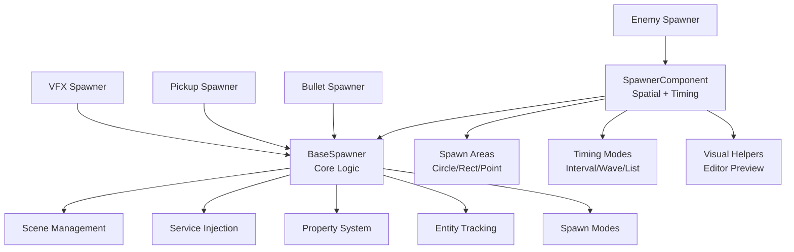
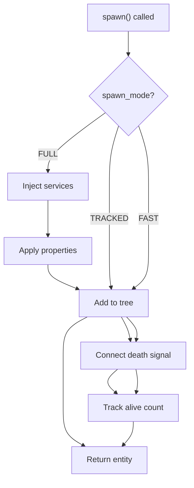
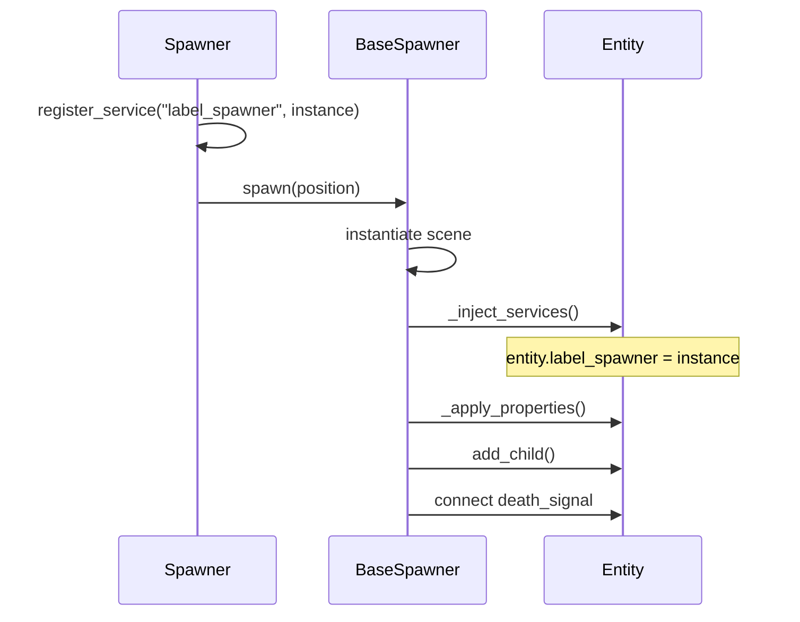
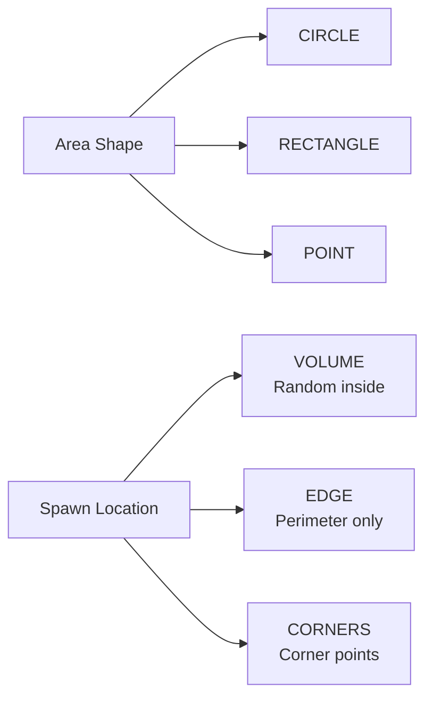
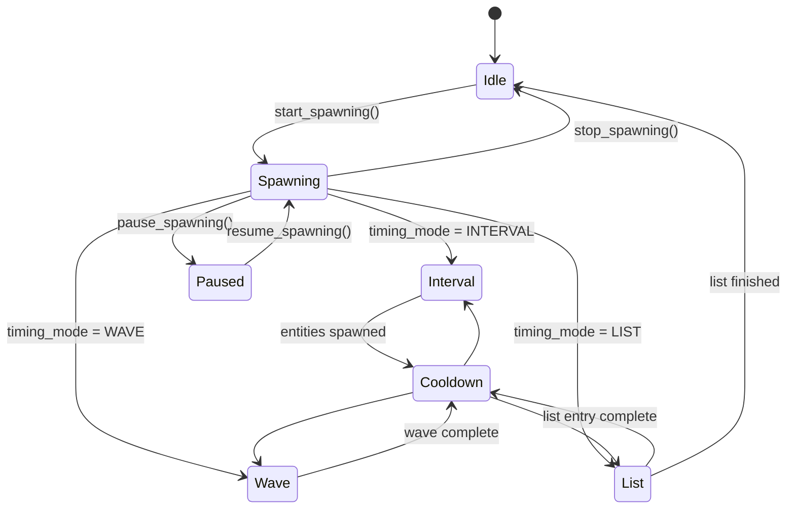
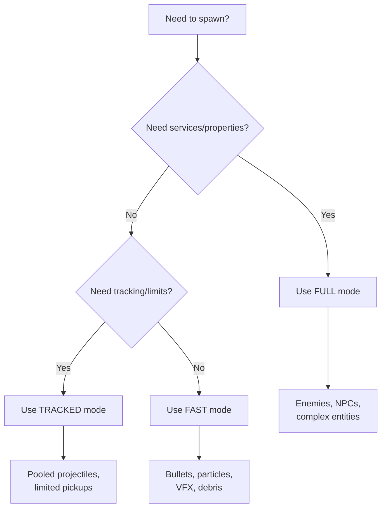
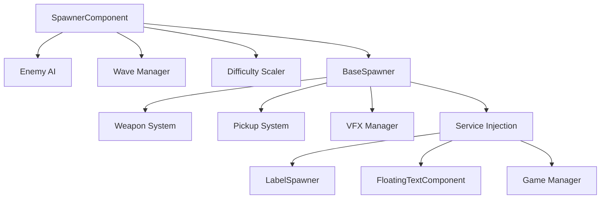

# Spawner System — Entity Instantiation & Injection

## Purpose

The Spawner System handles entity instantiation with:

* Scene management (single/multiple scenes)
* Dependency injection (services)
* Property assignment (static & dynamic)
* Entity tracking (alive count, death signals)
* Spawn limits (max alive, max total)
* Performance modes (FULL, TRACKED, FAST)

### What It Does NOT Do

* Handle timing/patterns (that's SpawnerComponent)
* Create projectiles directly (use ProjectileWeapon)
* Handle geometry/positioning (use SpawnerComponent for areas)
* Manage enemy AI
* Store game state

Those responsibilities belong to:

* **SpawnerComponent** → timing patterns + spatial geometry
* **WeaponNode** → projectile creation
* **Game Manager** → wave progression & state
* **Entity scripts** → behavior & AI

This separation allows BaseSpawner to be reused for enemies, bullets, pickups, VFX, particles, and any instantiation need.

---

## Architecture Overview



---

## BaseSpawner — Core Spawning Logic

### Spawn Modes

| Mode | Features | Use Cases |
| --- | --- | --- |
| **FULL** | Services + Properties + Tracking + Limits | Enemies, pickups, complex entities |
| **TRACKED** | Tracking + Limits only | Pooled projectiles, limited spawns |
| **FAST** | Minimal overhead (instantiate + add) | Bullets, particles, VFX |



---

## Service Injection System

Services are **shared references** injected into spawned entities. Think of it as dependency injection.

### How It Works

```gdscript
# In spawner setup (e.g., SpawnerComponent._enter_tree)
var label_spawner = LabelSpawner.new(...)
var floating_text = FloatingTextComponent.new(...)

register_service("label_spawner", label_spawner)
register_service("floating_text_component", floating_text)

# When entities spawn, they receive these references automatically
# Enemy entity now has:
# - enemy.label_spawner = (shared instance)
# - enemy.floating_text_component = (shared instance)
```

### Service Injection Flow



### Nested Service Injection

Services support dot notation for nested properties:

```gdscript
# Inject into nested components
register_service("ui.damage_display", damage_display_instance)
register_service("health_component.regeneration_system", regen_system)

# Entity receives:
# entity.ui.damage_display = damage_display_instance
# entity.health_component.regeneration_system = regen_system
```

---

## Property System

### Property Types

| Type | Description | When Applied |
| --- | --- | --- |
| **Services** | Shared references (not copied) | First (before properties) |
| **Advanced Properties** | Dynamic values with context | Second |
| **Global Properties** | Static values for all scenes | Third |
| **Scene Properties** | Per-scene overrides | Last (highest priority) |

### Advanced Properties (Context-Based)

Advanced properties use `SpawnPropertyValue` for dynamic values:

```gdscript
# Example: Enemy health scales with spawn index
var health_property = SpawnPropertyValue.new()
health_property.context_source = SpawnPropertyValue.ContextSource.SPAWN_INDEX
health_property.value_type = SpawnPropertyValue.ValueType.LINEAR
health_property.min_value = 50.0
health_property.max_value = 200.0

spawner.advanced_properties["health_component.max_health"] = health_property

# First enemy: health = 50
# 10th enemy: health = ~65
# 50th enemy: health = 200
```

### Context Sources

| Context | Description | Value Range |
| --- | --- | --- |
| `SPAWN_INDEX` | How many entities spawned | 0 to total_spawned |
| `SPAWN_PROGRESS` | Progress toward max_spawns | 0.0 to 1.0 |
| `ALIVE_COUNT` | Currently alive entities | 0 to alive_count |
| `TIME_ELAPSED` | Time since spawn started | 0.0 to infinity |
| `WAVE_NUMBER` | Current wave (SpawnerComponent) | 0 to wave count |
| `RANDOM` | Random value each spawn | 0.0 to 1.0 |

---

## SpawnerComponent — Spatial & Timing

Extends BaseSpawner with geometry and timing patterns.

### Spawn Areas



### Timing Modes

| Mode | Behavior | Configuration |
| --- | --- | --- |
| **INTERVAL** | Spawn at regular intervals | `spawn_interval`, `entities_per_spawn` |
| **WAVE** | Spawn bursts with cooldown | `wave_interval`, `wave_size` |
| **LIST** | Predefined spawn timeline | `spawn_list` (Dictionary) |

#### Timing Flow



---

## Example Presets

These are real, working configurations you can save as inherited scenes.

### 1. Basic Enemy Spawner (Interval)

```gdscript
# BaseSpawner settings
spawn_mode = BaseSpawner.SpawnMode.FULL
spawn_scene = preload("res://enemies/basic_enemy.tscn")
max_alive = 20
death_signal_name = "tree_exiting"

# SpawnerComponent settings
timing_mode = SpawnerComponent.TimingMode.INTERVAL
spawn_interval = 2.0
entities_per_spawn = 1
area_shape = SpawnerComponent.AreaShape.CIRCLE
spawn_radius = 100.0
spawn_location = SpawnerComponent.SpawnLocation.EDGE
auto_start = true
```

**Behavior:** Spawns 1 enemy every 2 seconds at circle edge, max 20 alive.

---

### 2. Wave-Based Spawner (Boss Fight)

```gdscript
# BaseSpawner settings
spawn_mode = BaseSpawner.SpawnMode.FULL
spawn_scenes = [
    preload("res://enemies/minion.tscn"),
    preload("res://enemies/elite.tscn")
]

# SpawnerComponent settings
timing_mode = SpawnerComponent.TimingMode.WAVE
wave_interval = 10.0
wave_size = 5
area_shape = SpawnerComponent.AreaShape.RECTANGLE
spawn_size = Vector2(400, 300)
spawn_location = SpawnerComponent.SpawnLocation.VOLUME

# Advanced properties (enemies get stronger per wave)
var health_prop = SpawnPropertyValue.new()
health_prop.context_source = SpawnPropertyValue.ContextSource.WAVE_NUMBER
health_prop.min_value = 100.0
health_prop.max_value = 500.0
advanced_properties["health_component.max_health"] = health_prop
```

**Behavior:** Spawns 5 enemies every 10 seconds in rectangle area. Enemy health increases per wave.

---

### 3. Bullet Spawner (Ultra Fast)

```gdscript
# BaseSpawner settings only (no SpawnerComponent needed)
spawn_mode = BaseSpawner.SpawnMode.FAST
spawn_scene = preload("res://projectiles/bullet.tscn")
spawn_parent = get_tree().root.get_node("ProjectileLayer")

# Usage in code
func _on_weapon_fired():
    spawner.spawn_fast(global_position + barrel_offset)
```

**Behavior:** Minimal overhead, just instantiate and add to tree. Perfect for bullets.

---

### 4. Pickup Spawner (Tracked Mode)

```gdscript
# BaseSpawner settings
spawn_mode = BaseSpawner.SpawnMode.TRACKED
spawn_scenes = [
    preload("res://pickups/health.tscn"),
    preload("res://pickups/ammo.tscn"),
    preload("res://pickups/coin.tscn")
]
max_alive = 10
death_signal_name = "collected"

# No timing needed - manual spawning
func spawn_random_pickup(position: Vector2):
    spawner.spawn(position, -1)  # -1 = random scene
```

**Behavior:** Tracks pickups, limits to 10 alive. No property injection overhead.

---

### 5. Timeline-Based Spawner (Scripted Events)

```gdscript
# SpawnerComponent settings
timing_mode = SpawnerComponent.TimingMode.LIST
spawn_scenes = [
    preload("res://enemies/grunt.tscn"),
    preload("res://enemies/tank.tscn"),
    preload("res://enemies/flyer.tscn")
]

# Spawn list: { delay_in_seconds: [scene_indices] }
spawn_list = {
    0.0: [0, 0],           # 2 grunts immediately
    2.5: [0, 0, 0],        # 3 grunts at 2.5s
    5.0: [1],              # 1 tank at 5s
    7.0: [2, 2],           # 2 flyers at 7s
    10.0: [0, 1, 2]        # 1 of each at 10s
}

auto_start = true
```

**Behavior:** Follows exact spawn timeline. Perfect for scripted encounters.

---

### 6. VFX Spawner (Fast Mode, No Tracking)

```gdscript
# BaseSpawner only
spawn_mode = BaseSpawner.SpawnMode.FAST
spawn_scenes = [
    preload("res://vfx/explosion.tscn"),
    preload("res://vfx/spark.tscn"),
    preload("res://vfx/smoke.tscn")
]

# Usage
func create_explosion(pos: Vector2, type: int = 0):
    spawner.spawn_fast(pos, type)
```

**Behavior:** No tracking, no limits, no injection. Pure performance.

---

## API Reference

### BaseSpawner Methods

| Method | Description |
| --- | --- |
| `spawn(position, scene_index, parent)` | Full-featured spawn with all modes |
| `spawn_fast(position, scene_index, parent)` | Ultra-fast spawn, bypasses everything |
| `register_service(name, service)` | Add injectable service |
| `unregister_service(name)` | Remove service |
| `set_spawn_property(path, value)` | Set property to inject |
| `reset()` | Reset counters |
| `get_alive_count()` | Get currently alive entities |
| `is_alive_limit_reached()` | Check if at max alive |

### SpawnerComponent Methods

| Method | Description |
| --- | --- |
| `start_spawning()` | Begin automatic spawning |
| `stop_spawning()` | Stop spawning |
| `pause_spawning()` | Pause (can resume) |
| `resume_spawning()` | Resume after pause |
| `spawn_entity(scene_index, position_override)` | Manual spawn at area position |
| `set_circle_area(center, radius)` | Configure circle spawn area |
| `set_rectangle_area(center, size)` | Configure rectangle spawn area |
| `set_spawn_list(list)` | Set spawn timeline |

---

## Signals

### BaseSpawner Signals

| Signal | When Emitted | Parameters |
| --- | --- | --- |
| `entity_spawned` | Entity successfully spawned | `entity: Node, scene_index: int` |
| `spawn_limit_reached` | Max spawns reached | None |

### SpawnerComponent Signals

| Signal | When Emitted | Parameters |
| --- | --- | --- |
| `spawning_started` | Spawning begins | None |
| `spawning_stopped` | Spawning ends | None |
| `spawning_paused` | Spawning paused | None |
| `spawning_resumed` | Spawning resumed | None |
| `wave_completed` | Wave finishes (WAVE mode) | `wave_number: int` |
| `list_completed` | Timeline finishes (LIST mode) | None |

---

## Performance Guidelines

### When to Use Each Mode



### Optimization Tips

1. **Use FAST mode for bullets** - Skip all injection/tracking overhead
2. **Pool projectiles in TRACKED mode** - Reuse instead of destroy/create
3. **Batch spawns** - Spawn 10 entities at once vs 1 per frame 10 times
4. **Use spawn_fast() directly** - Even faster than spawn() in FAST mode
5. **Limit max_alive** - Prevents thousands of entities
6. **Service injection is cheap** - Just reference assignment, no copying

### Memory Considerations

* Services are **shared references** (not copied)
* Properties are **assigned per entity** (copied)
* FAST mode allocates **~50% less memory** than FULL
* Label pooling reduces **GC pressure by 90%**

---

## Common Pitfalls

* Using FULL mode for bullets (massive overhead)
* Forgetting to set `spawn_parent` (spawns to self)
* Setting `max_alive` too low (spawning stops)
* Not connecting `death_signal_name` properly (tracking breaks)
* Using properties when you need services (copies instead of shares)
* Expecting SpawnerComponent timing without calling `start_spawning()`

---

## Relationship to Other Systems



---

## Design Philosophy

BaseSpawner is a **pure instantiation system** that answers:

> **"How do I create entities with the right data in the right place?"**

SpawnerComponent adds:

> **"When and where should entities appear?"**

Everything else (behavior, AI, damage, movement) is handled by the entities themselves or their components.

This matches your architecture:
* `DamageComponent`
* `HealthComponent`
* `WeaponComponent`
* `TargetingComponent`

All RefCounted, logic-only, reusable systems.