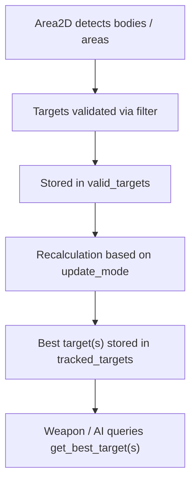
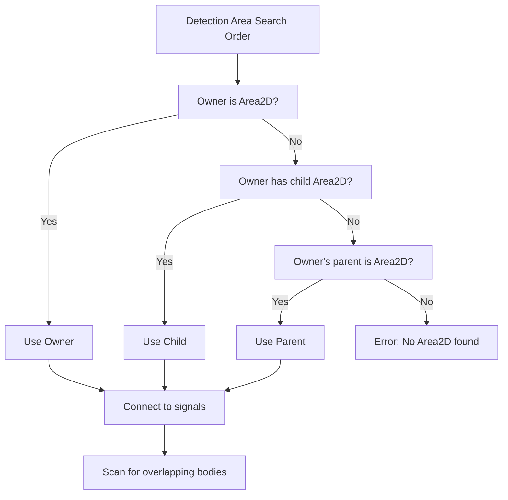
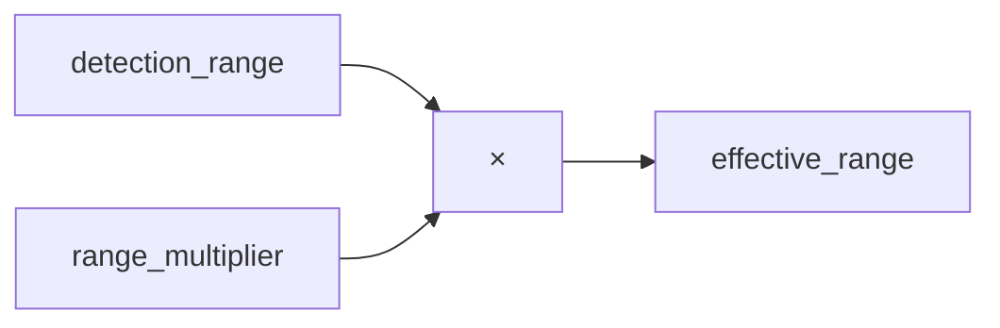
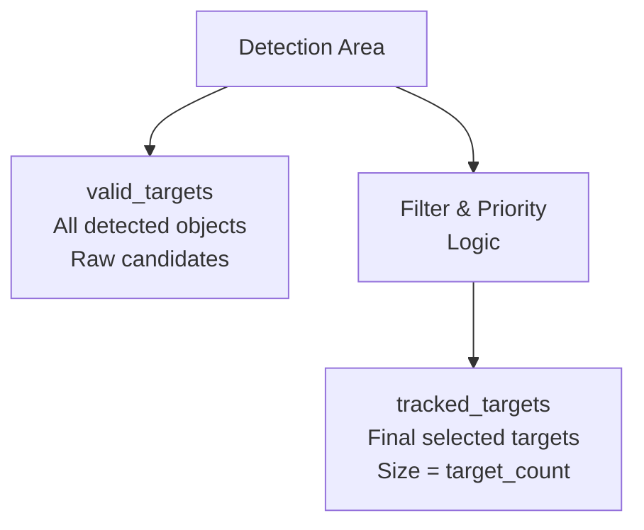

# TargetingComponent – Target Detection & Selection System

## Purpose

TargetingComponent is a pure logic targeting controller built on top of **Area2D-based detection**. It is responsible for:

- Detecting valid targets inside a range
    
- Tracking one or multiple targets
    
- Selecting the “best” target based on configurable priority rules
    
- Updating target selection efficiently using different update modes
    

### What It Does NOT Do

- Move entities
    
- Fire weapons
    
- Spawn projectiles
    
- Apply damage
    
- Control cooldowns
    
- Exist as a Node
    

Those responsibilities belong to:

- **WeaponNode / WeaponComponent** → firing logic
    
- **ProjectileWeapon / ImmediateWeapon** → execution
    
- **DamageComponent / HealthComponent** → combat resolution
    
- **Player / AI controllers** → behavior and input
    

Like your other core systems, TargetingComponent is **RefCounted, logic-only, and scene-independent**.

---

## High-Level Targeting Flow



---

## Core Concepts

### 1. Detection Area

TargetingComponent does **not** create physics shapes by default.  
Instead, it automatically attaches itself to an existing `Area2D`.

It searches in this order:



Once detected, it automatically connects to:

- `body_entered`
    
- `body_exited`
    
- `area_entered`
    
- `area_exited`
    

It also scans for already-overlapping bodies on setup.

---

### 2. Detection Shape & Range

The detection range is controlled by:

- `detection_range`
    
- `range_multiplier`
    

**Effective range calculation:**



Supported auto-scaled shape types:

- Circle
    
- Rectangle
    
- Capsule
    

If a custom shape is used, manual scaling is expected.

If `auto_update_shape` is enabled, the collision shape updates automatically when the range changes.

---

### 3. Valid Targets vs Tracked Targets

TargetingComponent maintains **two separate lists**:



This separation allows efficient filtering and prioritization without losing raw detection data.

---

### 4. Target Count

`target_count` controls how many targets are actively tracked.

Examples:

- `target_count = 1`  
    Lock-on missiles, homing projectiles, single-target turrets
    
- `target_count = 3`  
    Chain lightning, fork shots, multi-lock weapons
    
- `target_count = 10`  
    Swarm targeting, smart missile barrages
    

---

## Target Priority Modes

TargetingComponent supports the following priority rules:

**CLOSEST**  
Selects the nearest target by distance.

**FARTHEST**  
Selects the farthest target in range.

**LOWEST_HP**  
Selects the target with the lowest health.  
Requires `get_health()`, `health` property, or `Stat`.

**HIGHEST_HP**  
Selects the target with the highest health.

**RANDOM**  
Selects a random valid target.

**FIRST_SEEN**  
Selects the earliest detected target.

**LAST_SEEN**  
Selects the most recently detected target.

**CUSTOM**  
Fully user-defined priority logic using `target_filter`.

---

## Update Modes (Performance Control)

Update modes define **when target recalculation happens**.

**MANUAL**  
Targets only update when `get_best_target()` or `get_best_targets()` is called.

**ON_ENTER**  
Recalculates when a new target enters detection.

**ON_EXIT**  
Recalculates when a target exits detection.

**ON_TARGET_LOST (Default)**  
Recalculates only if a currently tracked target is lost.  
This is the most efficient option and ideal for bullet-hell scale games.

**AUTO**  
Recalculates periodically using `update(delta)` and `auto_refresh_interval`.  
More expensive than event-driven modes.

---

## Signals

**range_changed(new_range, old_range)**  
Emitted when the effective detection range changes.

**target_found(target)**  
Emitted when a valid target enters detection.

**target_lost(target)**  
Emitted when a target exits detection or becomes invalid.

**targets_changed(new_targets)**  
Emitted when the tracked target selection changes.

**target_limit_reached(rejected_target)**  
Emitted when `max_targets` prevents a new target from being added.

---

## Custom Target Filtering

`target_filter` is a `Callable` used in two different ways:

### When Priority ≠ CUSTOM

```
func(target: Node2D) -> bool
```

Used as a **validation filter** to decide whether a detected target is allowed.

Examples:

- Ignore shielded enemies
    
- Ignore low-priority enemies
    
- Only target bosses
    

---

### When Priority = CUSTOM

```
func(targets: Array[Node2D]) -> Node2D or Array[Node2D]
```

Used to **fully control the selection logic**.

Examples:

- Threat-based targeting
    
- Aggro-based targeting
    
- Cluster targeting
    
- Nearest enemy attacking the player
    

---

## Typical Usage Patterns

### 1. Homing Missile

- `target_count = 1`
    
- `priority = CLOSEST`
    
- `update_mode = ON_TARGET_LOST`
    

Missile locks onto the nearest enemy and only recalculates if that enemy dies.

---

### 2. Chain Lightning

- `target_count = 4`
    
- `priority = CLOSEST`
    
- `update_mode = ON_TARGET_LOST`
    

Lightning constantly tracks the four nearest enemies.

---

### 3. Defensive Turret

- `target_count = 1`
    
- `priority = FIRST_SEEN`
    
- `update_mode = ON_ENTER`
    

Turret never switches targets until the enemy leaves its range.

---

### 4. Boss Smart Weapon

- `target_count = 1`
    
- `priority = HIGHEST_HP`
    
- `update_mode = AUTO`
    
- `auto_refresh_interval = 0.3`
    

Boss continuously retargets the strongest enemy.

---

### 5. Free-Fire Player Weapon

- `needs_targeting = false` in WeaponNode
    
- TargetingComponent may exist but is ignored
    
- Weapon fires forward even with zero enemies
    

---

## Health Detection Rules

Target health is resolved in this order:

1. `get_health()` method
    
2. `health` property
    
3. `Stat` stored as health
    

If none exist, the target is ignored for HP-based priorities.

---

## Performance Notes

TargetingComponent is optimized for **medium-scale combat**.

Safe range:

- 5–100 active enemies
    

Future large-scale improvements (if needed later):

- Spatial partitioning (grid or quad-tree)
    
- Group-based filtering
    
- Cached distance buckets
    

The default `ON_TARGET_LOST` mode already avoids most unnecessary recalculations.

---

## Common Pitfalls

- Forgetting to assign or auto-detect an `Area2D`
    
- Using `AUTO` mode when `ON_TARGET_LOST` would be sufficient
    
- Using HP-based priorities with hundreds of targets
    
- Forgetting to disable `needs_targeting` for free-fire weapons
    
- Forgetting to cap `max_targets` in chaotic scenes
    

---

## Final Summary

TargetingComponent is a **flexible, event-driven, logic-only targeting system**.

It provides:

- Clean separation between detection and selection
    
- Multiple built-in priority strategies
    
- Single and multi-target support
    
- Performance-friendly update modes
    
- Full custom targeting control via Callables
    

It integrates directly with your weapon and AI systems without owning any visual or gameplay execution itself.