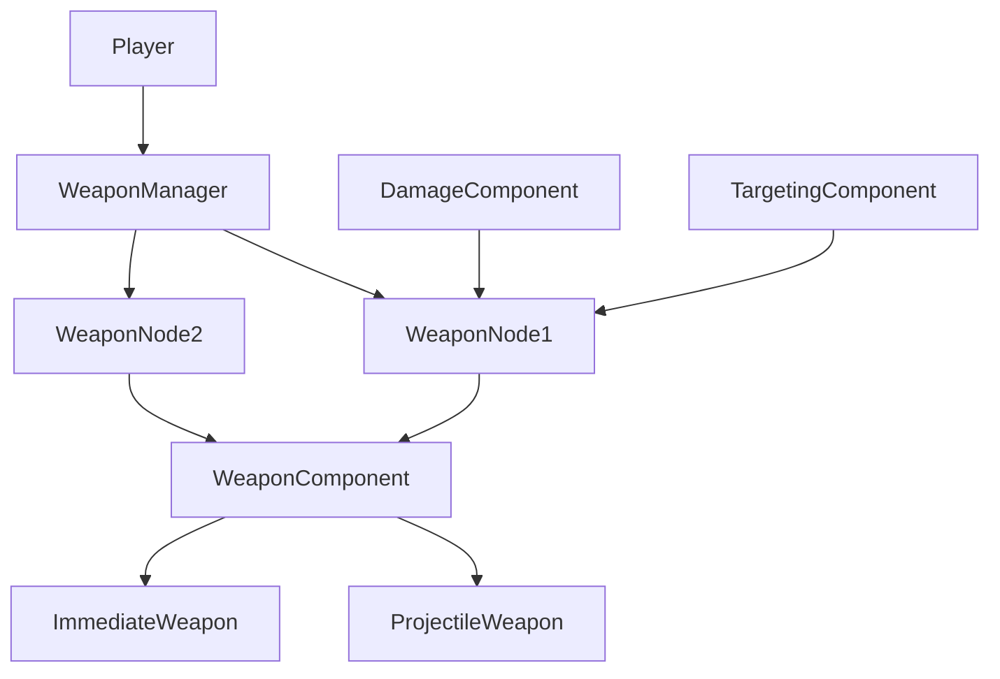

# WeaponManager – Global Weapon Control & Stat Provider

## Purpose

`WeaponManager` is the **central controller for all WeaponNode instances** attached to a character (player, enemy, turret, boss, etc).

It is responsible for:

- Managing **global weapon stats**
    
- Passing **DamageComponent & TargetingComponent** to weapons
    
- Providing a **buff-accessible stat interface**
    
- Providing **high-level fire control**
    
- Managing the **weapon registry**
    

It does **not**:

- Execute weapon logic
    
- Fire projectiles itself
    
- Handle targeting logic
    
- Apply damage directly
    

Those responsibilities belong to:

- `WeaponNode`
    
- `WeaponComponent`
    
- `ProjectileWeapon` / `ImmediateWeapon`
    
- `TargetingComponent`
    
- `DamageComponent`
    

---

## Design Role in Architecture



`WeaponManager` acts as:

- ✅ **Global stat authority**
    
- ✅ **Weapon injector**
    
- ✅ **Fire command dispatcher**
    
- ✅ **Buff stat resolver**
    

---

## Global Stats (Inspector)

These stats apply **globally to all weapons** under the manager.

```gdscript
@export var damage: Stat
@export var fire_rate: Stat
@export var projectile_speed: Stat
@export var weapon_range: Stat
@export var crit_chance: Stat
@export var crit_damage: Stat
```

These stats:

- ✅ Are buffable
    
- ✅ Are scalable
    
- ✅ Can be overridden by parent
    
- ✅ Can be used as parent stats for `ScaledStat` inside weapons
    

---

## Parent Stat Override

```gdscript
@export var override_parent_stats: bool = true
```

If enabled:

WeaponManager will attempt to replace its local stats with:

```text
Stat.get_stat(parent, "damage")
Stat.get_stat(parent, "fire_rate")
Stat.get_stat(parent, "projectile_speed")
Stat.get_stat(parent, "weapon_range")
Stat.get_stat(parent, "crit_chance")
Stat.get_stat(parent, "crit_damage")
```

This allows:

- Player to own **true global stats**
    
- WeaponManager to act only as a **stat relay**
    
- Enemies to reuse the same system with local stats
    

---

## Weapon Registry

### Add Weapon

```gdscript
add_weapon(weapon: WeaponNode)
```

- Adds weapon as child
    
- Injects shared components
    
- Safe at runtime
    

---

### Remove Weapon

```gdscript
remove_weapon(weapon: WeaponNode)
```

---

### Get All Weapons

```gdscript
get_weapons() -> Array[WeaponNode]
```

---

### Find Weapon by ID

```gdscript
find_weapon(weapon_id: String) -> WeaponNode
```

Weapon ID is read from:

```gdscript
@export var weapon_id: String
```

inside `WeaponNode`.

---

## Fire Control API

### Fire Single Weapon

```gdscript
fire_weapon("minigun")
```

- Checks if weapon exists
    
- Checks if weapon is enabled
    
- Calls `weapon.fire()`
    

---

### Stop Single Weapon

```gdscript
stop_weapon("minigun")
```

Cancels continuous fire if active.

---

### Fire All Weapons

```gdscript
fire_all()
```

Fires all enabled weapons in parallel.

---

### Stop All Weapons

```gdscript
stop_all()
```

---

### Enable Weapon

```gdscript
enable_weapon("shotgun")
```

---

### Disable Weapon

```gdscript
disable_weapon("shotgun")
```

---

## Shared Component Injection

WeaponManager automatically passes:

```gdscript
damage_component
targeting_component
```

from its parent to all `WeaponNode`s.

This happens:

- On `_enter_tree()`
    
- When calling `add_weapon()`
    
- When calling `set_components()`
    

Weapons **never pull components themselves**.

---

## Buff System Integration

WeaponManager exposes stats via:

```gdscript
func get_stat(stat_name: String) -> Stat
```

Supported names:

```text
damage
fire_rate
projectile_speed
range / weapon_range
crit_chance
crit_damage
```

This allows:

```gdscript
Stat.get_stat(weapon_manager, "damage")
```

to work automatically with your buff system.

Weapon-specific stats (like `"minigun.damage"`) are resolved in **WeaponNode**, not here.

---

## Manual Component Override

```gdscript
set_components(damage_component, targeting_component)
```

Use this when:

- Spawning characters dynamically
    
- Swapping controllers
    
- Hot-swapping combat layers
    

It immediately re-injects components into all weapons.

---

## What WeaponManager Does NOT Do

❌ It does not calculate DPS  
❌ It does not handle fire intervals  
❌ It does not manage cooldown logic  
❌ It does not select targets  
❌ It does not execute damage  
❌ It does not apply buffs itself

All of that belongs to:

- `WeaponComponent`
    
- `ProjectileWeapon`
    
- `ImmediateWeapon`
    
- `TargetingComponent`
    
- `DamageComponent`
    

---

## Design Summary

WeaponManager is:

✅ A **global stat container**  
✅ A **weapon registry**  
✅ A **fire command dispatcher**  
✅ A **component injector**  
✅ A **buff-accessible stat provider**

It is **not part of the actual combat execution layer**.

---