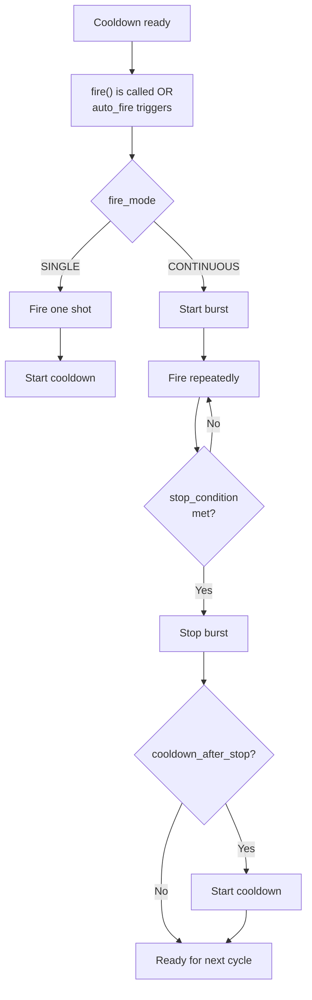
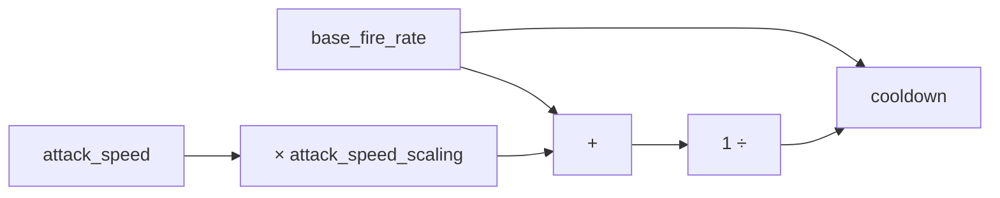
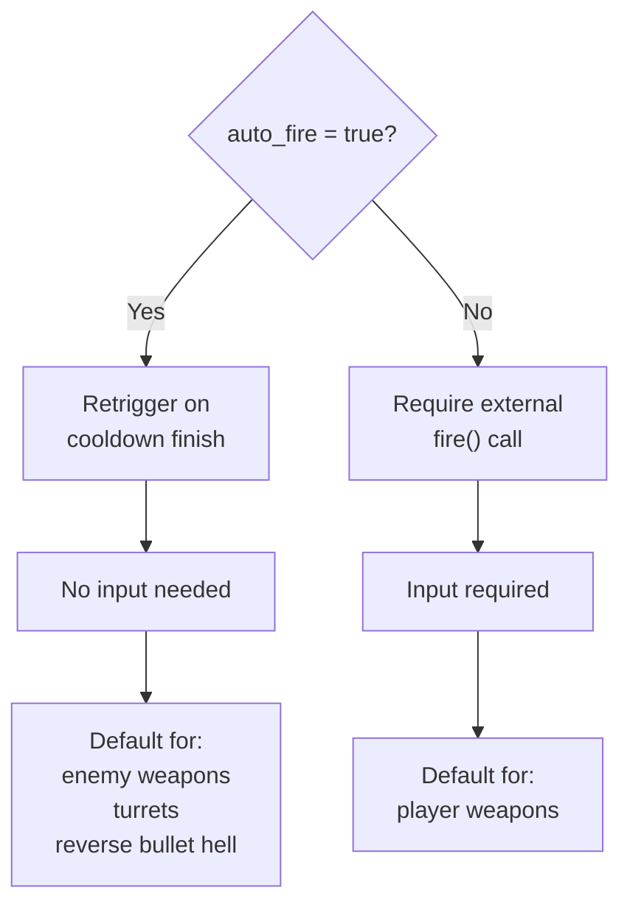
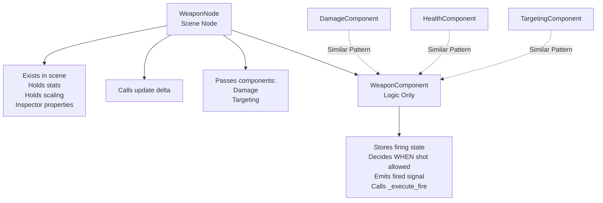

# WeaponComponent – Firing Logic System

## Purpose

WeaponComponent is a pure logic firing controller that handles:

* Cooldowns
* Auto-fire
* Single fire
* Burst fire (continuous)
* Manual fire (hold & release)
* Time-based fire streams
* Shot-count-based bursts

### What It Does NOT Do

* Spawn projectiles
* Apply damage
* Select targets
* Handle player input
* Exist as a Node

Those responsibilities belong to:

* **WeaponNode** → authoring + stats + inspector interface
* **ProjectileWeapon / ImmediateWeapon** → execution
* **Player / AI controllers** → input & behavior

This separation allows WeaponComponent to be reused across player weapons, enemy weapons, turrets, abilities, spells, and traps.

---

## High-Level Fire Flow



---

## Core Concepts

### 1. Cooldown (Between Bursts)

**Controlled by:**
* `base_fire_rate`
* `attack_speed`
* `attack_speed_scaling`

**Formula:**



This controls how often a weapon can start a new attack cycle. This is the delay between bursts or single shots.

---

### 2. Fire Interval (Inside a Burst)

**Controlled by:**
* `fire_interval`

This controls how fast bullets come out during a continuous attack. This is NOT the cooldown—it's the gap between shots inside one burst.

---

### 3. Fire Modes

| Mode | Behavior |
| --- | --- |
| **SINGLE** | Fires exactly one shot, then enters cooldown |
| **CONTINUOUS** | Fires repeatedly until `stop_condition` is met |

---

### 4. Stop Conditions (CONTINUOUS Only)

| Condition | Behavior |
| --- | --- |
| **SHOT_COUNT** | Stops after `max_shots` are fired |
| **DURATION** | Stops after `max_duration` seconds |
| **MANUAL** | Stops only when `cancel_continuous_fire()` is called externally |

---

### 5. Auto Fire



---

## Runtime State Variables (Internal)

These are handled internally and should **not** be set manually:

| Variable | Purpose |
| --- | --- |
| `is_firing` | Currently in a burst |
| `cooldown_timer` | Tracks cooldown progress |
| `shots_fired` | Shots fired in current burst |
| `continuous_timer` | Elapsed burst time |
| `fire_interval_timer` | Timer for next shot inside burst |

---

## Signals

| Signal | Description | Parameters |
| --- | --- | --- |
| `fired` | Emitted every time a shot is executed | None |
| `cooldown_ready` | Emitted when cooldown finishes | None |
| `continuous_fire_started` | Emitted when a burst starts | None |
| `continuous_fire_stopped` | Emitted when a burst ends | None |

---

## Inspector-Controlled Settings (via WeaponNode)

These values are exposed in WeaponNode and directly control WeaponComponent behavior:

* `fire_mode`
* `stop_condition`
* `fire_interval`
* `max_shots`
* `max_duration`
* `fire_on_start`
* `cooldown_after_stop`
* `auto_fire`

---

## Example Weapon Presets

These are real, working presets you can save as inherited weapon scenes.

### 1. Basic Pistol (Single Fire)

```
fire_mode = SINGLE
auto_fire = false
fire_rate = 3.0
```

**Behavior:** Fires once per input, cooldown between each shot.

---

### 2. Machine Gun (Auto Single Fire)

```
fire_mode = SINGLE
auto_fire = true
fire_rate = 10.0
```

**Behavior:** Constant stream of bullets with even spacing. No burst behavior.

---

### 3. Burst Rifle (5-Shot Burst)

```
fire_mode = CONTINUOUS
stop_condition = SHOT_COUNT
max_shots = 5
fire_interval = 0.08
fire_on_start = true
cooldown_after_stop = true
auto_fire = true
fire_rate = 1.0
```

**Visual behavior:** `pop pop pop pop pop — pause — repeat`

---

### 4. Shotgun (Instant Multi-Shot Burst)

```
fire_mode = CONTINUOUS
stop_condition = SHOT_COUNT
max_shots = 5
fire_interval = 0.01
fire_on_start = true
cooldown_after_stop = true
auto_fire = false
fire_rate = 0.8
```

**Behavior:** All pellets fire almost instantly, long reload delay.

---

### 5. Laser Beam / Flamethrower (Duration-Based)

```
fire_mode = CONTINUOUS
stop_condition = DURATION
max_duration = 1.2
fire_interval = 0.05
fire_on_start = true
cooldown_after_stop = true
auto_fire = false
fire_rate = 0.5
```

**Behavior:** Continuous stream for 1.2 seconds, cooldown before next use.

---

### 6. Minigun (Reverse Bullet Hell Core Weapon)

```
fire_mode = CONTINUOUS
stop_condition = DURATION
max_duration = 9999
fire_interval = 0.03
fire_on_start = true
cooldown_after_stop = false
auto_fire = true
fire_rate = 999
```

**Behavior:** Never stops, pure continuous bullet wall.

---

### 7. Hold-to-Fire Weapon (Manual Mode)

```
fire_mode = CONTINUOUS
stop_condition = MANUAL
fire_interval = 0.08
fire_on_start = true
cooldown_after_stop = true
auto_fire = false
fire_rate = 1.5
```

**Behavior:** Fires while input is held, stops on input release, cooldown after release.

---

## Relationship to WeaponNode

**WeaponNode** is a visual and stat wrapper for WeaponComponent.



This design matches your global architecture:
* `DamageComponent`
* `HealthComponent`
* `TargetingComponent`

All are RefCounted, logic-only, scene-independent systems.

---

## Common Pitfalls

* Forgetting to enable `auto_fire` when no input exists
* Using CONTINUOUS without correctly setting `stop_condition`
* Setting `max_shots` when `stop_condition` is DURATION
* Setting `fire_interval` too low and destroying performance
* Expecting WeaponComponent to spawn projectiles (it does not)

---

## Design Summary

WeaponComponent is a **pure time-based decision system** that answers only one question:

> **"Is the weapon allowed to fire right now?"**

Everything else (visuals, projectiles, damage, targeting, input) is handled by other systems.